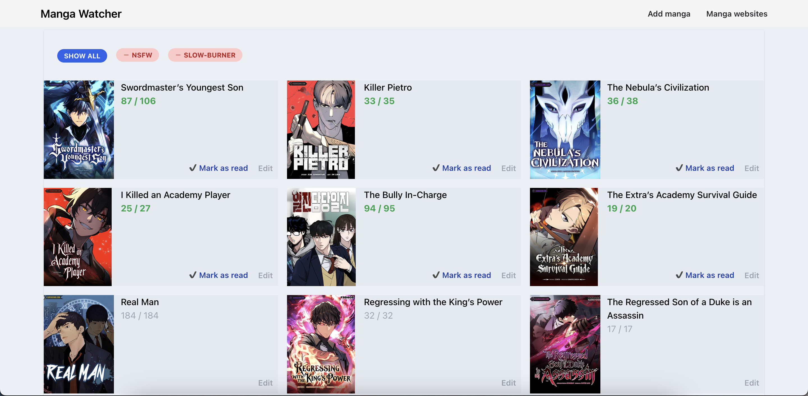

# Manga Watcher [](https://github.com/monshq/manga_watcher/actions/workflows/mix_check.yml) [](https://coveralls.io/github/monshq/manga_watcher?branch=master)

If you read a lot of ongoing mangas / manhwas, then you probably had difficulties keeping in memory what chapter you stopped at. This project does this for you. You enter manga url, application parses the page and gets manga title, preview and last chapter. Then it scans the page periodically and shows you when there are new chapters you haven't read yet:



It supports any manga website that doesn't block access to it via captcha or checking for browser features. To be able to add manga from a new website you have to create it on "Manga websites" page and add css selectors for title, links and preview. If you used ublock to block adds manually before, these selectors are pretty much the same.

# Deploying

```sh
SERVER=your.server.com make release
```
Requirements:
- docker locally to build the app
- `/srv/projects` to be created and writable by current user
- systemd and [init-exporter](https://github.com/funbox/init-exporter) installed on server
- filled `secrets.exs` config with http server and psql config
