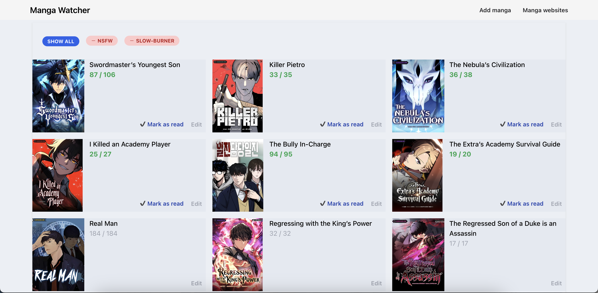

# Manga Watcher [](https://github.com/monshq/manga_watcher/actions/workflows/mix_check.yml) [](https://coveralls.io/github/monshq/manga_watcher?branch=master)

If you read a lot of ongoing mangas / manhwas, then you probably had difficulties keeping in memory what chapter you stopped at. This project does this for you. You enter manga url, application parses the page and gets manga title, preview and last chapter. Then it scans the page periodically and shows you when there are new chapters you haven't read yet:



It supports any manga website that doesn't block access to it via captcha or checking for browser features. To be able to add manga from a new website you have to create it on "Manga websites" page and add css selectors for title, links and preview. If you used ublock to block adds manually before, these selectors are pretty much the same.

# Adding sources with Hermes

Sources can also be added and repaired by the [Hermes](https://github.com/NousResearch/hermes-agent) agent running on the same server. The app exposes an api for it under `/api/agent` (probe a page, test selectors, save a source) and the skill in [hermes/manga-source](hermes/manga-source/SKILL.md) tells the agent how to use it. The app always downloads and parses pages itself, so a source that passes the checks works for the update poller too.

To install the skill, link it into Hermes' skills directory:

```sh
ln -s /path/to/manga_watcher/hermes/manga-source ~/.hermes/skills/manga-source
```

The agent api has no authentication. Block it in the reverse proxy and publish the container port on localhost only (`-p 127.0.0.1:8080:3000`), e.g. for Caddy:

```
@agent_api path /api/agent /api/agent/*
handle @agent_api {
        respond 404
}
```

# Deploying

```sh
SERVER=your.server.com make release
```
Requirements:
- psql installed somewhere
- docker or podman to build the image like `docker build .`
- the following env vars set for the container environment: `DB_USERNAME`, `DB_PASSWORD`, `DB_HOSTNAME`, `DB_NAME`, `PHX_HOST`, `SECRET_KEY_BASE`, `S3_BUCKET`, `S3_ASSET_HOST`, `S3_ACCESS_KEY_ID`, `S3_SECRET_ACCESS_KEY`

## Maintenance tasks

Update every manga whose preview image is missing:

```sh
bin/manga_watcher rpc 'MangaWatcher.Tasks.UpdateMissingImages.run()'
```

When running from source instead of a release, use `mix mangas.update_missing_images`.
